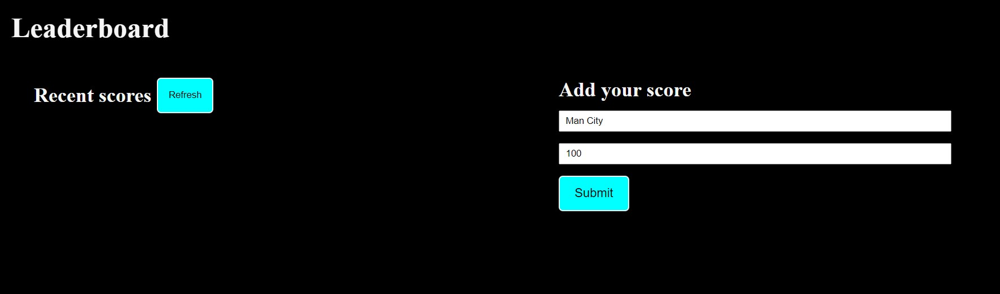
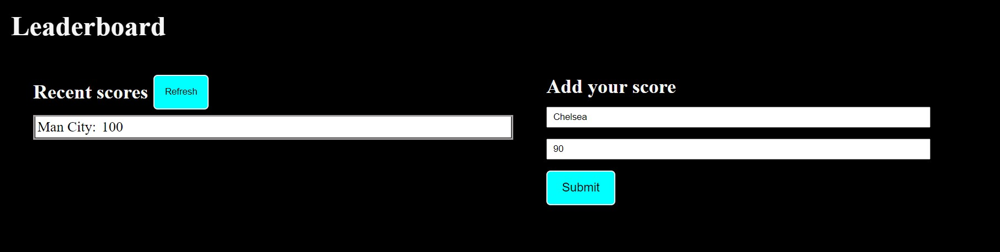

# Leaderboard<!---Title of Project-->

## Leaderboard:  <!---Title of Project-->

The "Leaderboard" website displays scores submitted by different players. It also allows you to submit your score. All data is preserved thanks to the external Leaderboard API service.

Project 1: basic page structure.I will build a simple HTML leaderboard. The leaderboard will be styled according to the specifications listed in the lesson. This simple web page will be built using webpack.

Project 2: send and receive data from API.

Project 3:final touches

<!-- TABLE OF CONTENTS -->

# 📗 Table of Contents

- [📖 About the Project](#about-project)
  - [🛠 Built With](#built-with)
  - [🚀 Live Demo](#live-demo)
- [💻 Getting Started](#getting-started)
- [👥 Authors](#authors)
- [🔭 Future Features](#future-features)
- [🤝 Contributing](#contributing)
- [⭐️ Show your support](#support)
- [🙏 Acknowledgements](#acknowledgements)
- [📝 License](#license)

<!-- PROJECT DESCRIPTION -->

# 📖 Leaderboard <!---Project title-->
<table style="border: 2px solid black;">
  <tr style="border: 2px solid black;">
  <td>Empty Leaderboard</td>
  <td style="border: 1px solid black;"></td>
  </tr>
  <td>Add to Leaderboard</td>
  <td style="border: 1px solid black;"></td>
  </tr>
    <tr style="border: 2px solid black;">
  <td>Add second Team to Leaderboard</td>
  <td style="border: 1px solid black;"></td>
  </tr>
  <tr style="border: 2px solid black;">
  <td>Refresh Leaderboard</td>
  <td style="border: 1px solid black;"></td>
  </tr>
</table>

Here are some features of the page:

<ul>
  <li>Type name of team</li>
  <li>Type your score</li>
  <li>Submit name and score</li>
  <li>Refresh the page and the data will reapear on under the Scores</li>
</ul>

## 🛠 Built With 
    HTML
    CSS
    Javascript

(<a href="#readme-top">back to top</a>)

<!-- LIVE DEMO -->

## 🚀 Live Demo 

[Leaderboard live link](https://lucash2022.github.io/Leaderboard/dist/)
 

(<a href="#readme-top">back to top</a>)

<!-- GETTING STARTED -->

## 💻 Getting Started 

- Create a local directory that you want to clone the repository.

- Open the command prompt in the created directory.

- On the terminal run this command git clone [https://github.com/Lucash2022/Leaderboard.git]

- Go to the repository folder using command prompt cd Leaderboard

- Install the dev dependencies for linters run npm install.

- To start run npm start

(<a href="#readme-top">back to top</a>)

### Prerequisites

In order to run this project you need:

-A working browser application (Google chrome, Mozilla Fire fox, Microsoft edge ...)

-VSCode or any other equivalent code editor

-Node Package Manager (For running, debuging, or installing dependancies to be used)

(<a href="#readme-top">back to top</a>)

### Setup

Clone this repository to your desired folder:

- Open the command prompt in the created directory.

- On the terminal run this command git clone https://github.com/Lucash2022/Leaderboard.git

- Go to the repository folder using command prompt cd Leaderboard

- Install the dev dependencies for linters run npm install.

- To start run npm start
--->

(<a href="#readme-top">back to top</a>)

<!-- Author -->

## 👤**Authors** 
<h4>Lucas Erkana</h4>

[githubhandle](https://github.com/Lucash2022)
 
 [twitterhandle](https://twitter.com/@Lucas_David_22)
 
[linkedIn](https://www.linkedin.com/in/lucas-erkana-b30a0b3b/)
   
[facebook](https://www.facebook.com/lucash.toni)

(<a href="#readme-top">back to top</a>)

<!-- FUTURE FEATURES -->

## 🔭 Future Features 

- Implement ordering scores in descending order
- Implement checks to make sure a Name is not entered twice
- Display an error message when a blank name is enetered

(<a href="#readme-top">back to top</a>)

<!-- CONTRIBUTING -->

## 🤠Contributing 

Contributions, issues, and feature requests are welcome!

Feel free to check the [issues page](https://github.com/Lucash2022/Leaderboard/issues).

(<a href="#readme-top">back to top</a>)

<!-- SUPPORT -->

## ⭐️ Show your support 

Give a ⭐️ if you like this project!

(<a href="#readme-top">back to top</a>)

<!-- ACKNOWLEDGEMENTS -->

## 🙠Acknowledgments 
Alex Ogeto
 
[linkedIn](https://www.linkedin.com/in/alexogeto/)
 
[githubhandle](https://github.com/Osoro254Alex/)

[Font Awesome](https://fontawesome.com/search?q=book&o=r)

[Icons8](https://icons8.com/icons/set/books)

[Google Fonts](https://developers.google.com/fonts)

[Bootsrtap](https://getbootstrap.com/docs/5.1/getting-started/introduction/)

[Luxon](https://imdac.github.io/modules/js/luxon/)

(<a href="#readme-top">back to top</a>)

<!-- LICENSE -->

## 📠License 

This project is [MIT](./LICENSE) licensed.

_NOTE: we recommend using the [MIT license](https://choosealicense.com/licenses/mit/) - you can set it up quickly by [using templates available on GitHub](https://docs.github.com/en/communities/setting-up-your-project-for-healthy-contributions/adding-a-license-to-a-repository). You can also use [any other license](https://choosealicense.com/licenses/) if you wish._

(<a href="#readme-top">back to top</a>)

